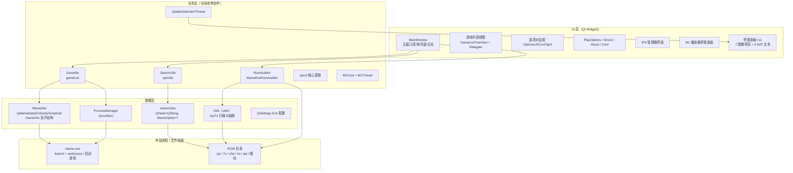
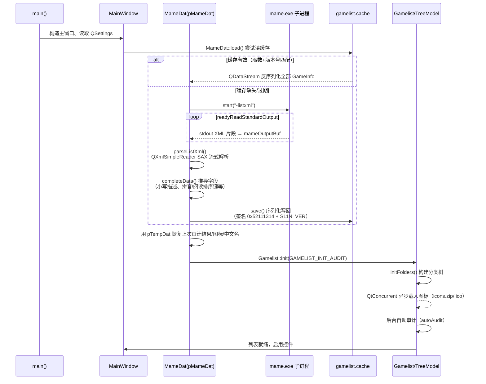
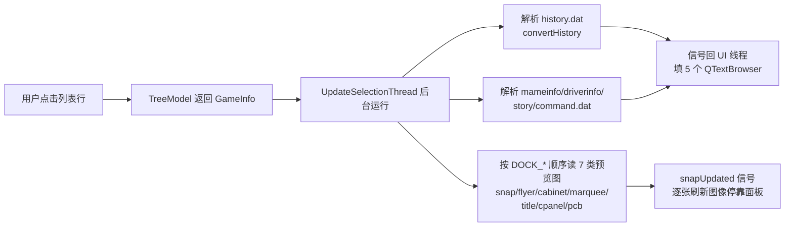
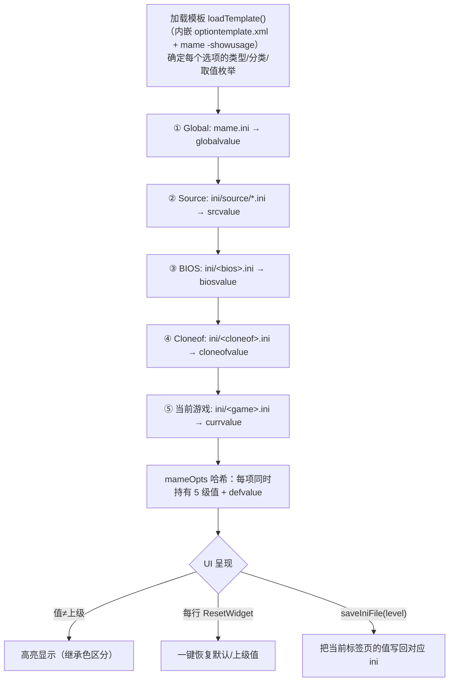

# MAME Plus! GUI（mamepgui）1.8.2 技术架构文档

> 本文是对 mamepgui 1.8.2 源码包的技术架构分析，供阅读源码或后续移植参考。
> 文中所有路径均相对源码包根目录。

---

## 目录

1. [原项目概述](#一原项目概述)
2. [源码树状结构](#二源码树状结构)
3. [总体技术架构](#三总体技术架构)
4. [核心数据流](#四核心数据流)
5. [各模块详解与实现细节](#五各模块详解与实现细节)
6. [资源体系：图标 / 字体 / 翻译 / 皮肤](#六资源体系图标--字体--翻译--皮肤)
7. [构建体系](#七构建体系)
8. [运行时配置与文件布局](#八运行时配置与文件布局)
9. [已知设计特点与技术债](#九已知设计特点与技术债)

---

## 一、原项目概述

mamepgui 是 **MAME Plus!** 衍生的 **MAME 模拟器图形前端**。它本身不包含任何模拟核心，
职责只有三件事：

1. **管理游戏列表** —— 调用 MAME 的 `-listxml` 获取全部游戏的元数据，按几十种维度组织成
   分类树供浏览、搜索、过滤；
2. **管理配置** —— 对 MAME 的 ini 选项体系做多层继承式编辑（全局 / 驱动 / BIOS / 克隆 / 单个游戏）；
3. **启动与审计** —— 按用户配置拼装命令行拉起 `mame.exe`，并对本地 ROM/Sample 做
   crc/sha1 完整性审计、导出缺失清单。

关键事实速览：

| 项目 | 说明 |
| --- | --- |
| 语言 / 框架 | C++（Qt 4 时代风格），GUI 框架为 **Qt 4.6.0 静态链接** |
| 构建 | qmake（`mamepgui.pro`）+ 32 位 MinGW，Windows 上一键 `build.bat` |
| 代码体量 | 11 组 `.cpp/.h` 共约 **13,473 行**，另有 9 个 Qt Designer `.ui` 界面文件 |
| 第三方库 | QuaZip（zip 读写）、LZMA（7z 支持）、SDL（可选，手柄导航）、zlib 头文件 |
| 界面语言 | 10 种（简繁中文、日、英、西、法、匈、韩、葡（巴西）、俄、意），Qt Linguist `.ts` |
| 特性亮点 | 六层选项继承与差异高亮、内置 ROM 审计 + fixdat 导出、IPS 补丁管理、内嵌 M1 街机音乐播放器、MESS/UME 家用机软列表支持 |
| 与 MAME 的通信方式 | **纯文本协议**：命令行参数 + 读取子进程 stdout（`-listxml` / `-verifyroms` 等），无任何私有插件接口 |

一个游戏条目的完整生命周期：`mame -listxml` 输出 XML → SAX 解析成 `GameInfo` →
持久化到本地缓存 → 进入分类树模型 → 用户双击 → 拼命令行启动 MAME。

---

## 二、源码树状结构

```
mamepgui-1.8.2/
├── mamepgui.pro              # qmake 工程文件（相对路径引用同级 qt-4.6.0）
├── common_settings.pri       # 公共构建配置：静态链接、SDL、中间文件目录
├── build.bat                 # 一键编译 release → bin/mamepgui.exe
├── buildDEBUG.bat            # 一键编译 debug   → bin/mamepgui_DEBUG.exe
├── clean.bat                 # 清理构建产物
├── mamepgui.rc / .icns       # Windows 资源脚本 / macOS 图标
├── mamepgui.qrc              # Qt 资源集合（嵌入 res/ 下图标、皮肤、模板）
│
├── prototype.h/.cpp   (1031) # ★ 数据模型层：GameInfo/MameDat 及全部子结构、-listxml 解析、缓存序列化
├── gamelist.h/.cpp    (3912) # ★ 游戏列表：树模型/代理模型/自绘委托/分类文件夹/图标加载/启动 MAME
├── mameopt.h/.cpp     (2618) # ★ 选项系统：六层 ini 继承链、选项编辑 UI、ini 读写
├── mainwindow.h/.cpp  (1622) # 主窗口：菜单/停靠面板/托盘/多语言/皮肤/日志/布局持久化
├── audit.h/.cpp        (671) # ROM 审计：内置 crc/sha1 比对线程 + mame -verifyroms 封装
├── utils.h/.cpp        (681) # 工具箱：zip/7z 内文件遍历与抽取、MAME 版本探测、字符串工具
├── ips.h/.cpp          (523) # IPS 补丁管理器：补丁目录扫描、依赖/冲突关系、启用保存
├── m1.h/.cpp           (393) # M1 街机音乐播放器集成：动态加载 m1snd 库 + 播放线程
├── dialogs.h/.cpp      (370) # 播放选项/目录设置/关于/命令行 四个对话框
├── processmanager.h/.cpp(124) # QProcess 池：统一启动、读输出、终止
├── screenshot.h/.cpp    (115) # 截图停靠面板：等比缩放、旋转
│
├── mainwindow.ui           # 9 个 Qt Designer 界面文件（mainwindow/options/playoptions/
├── options.ui              #    csvcfg/directories/about/cmd/ips/m1），uic 生成 ui_*.h
├── ...
│
├── lang/                   # 10 国语言 .ts 源文件 → lrelease 生成 .qm
├── docs/                   # readme.txt / compile.txt / todo.txt / whatsnew
├── res/                    # 图标(16x16,32x32)、视图位图、mamepgui.ini(GUI 默认设置模板)、
│   │                       # optiontemplate.xml(选项呈现模板)、皮肤
├── include/                # SDL、zlib 头文件
├── lib/<平台>/             # 预编译静态库 libquazip.a、liblzma.a（另有 libSDL.a）
├── quazip/  lzma/          # 上述两库的源码副本（构建时直接链接预编译库）
└── bin/  tmp/              # 构建输出与 moc/uic/rcc 中间目录（构建时生成）
```

---

## 三、总体技术架构

### 3.1 分层架构图



### 3.2 协作风格：全局单例 + 信号槽

模块间通过 `extern` 全局指针直接访问，没有接口边界：

| 全局对象 | 类型 | 作用 |
| --- | --- | --- |
| `win` | `MainWindow*` | 主窗口，几乎所有模块回它打日志、取控件 |
| `gameList` | `Gamelist*` | 游戏列表控制器 |
| `pMameDat` / `pFixDat` / `pTempDat` | `MameDat*` | 主游戏库 / 补全 DAT / 缓存临时库 |
| `mameOpts` | `QHash<QString, MameOption*>` | 全部选项的当前状态（含各级值） |
| `optUtils` | `OptionUtils*` | 选项加载/保存服务 |
| `utils` | `Utils*` | 文件扫描工具 |
| `procMan` | `ProcessManager*` | 子进程池 |
| `currentGame` / `currentFolder` | `QString` | 当前选中状态 |
| `mame_binary` / `mameIniPath` / `language` | `QString` | 全局环境状态 |

跨线程通信一律走 Qt 信号槽（队列连接），后台线程类有三个：
`UpdateSelectionThread`（选中项的 DAT/截图加载）、`RomAuditor`（审计）、
`M1Thread`（音乐播放）；另有 `QtConcurrent::run` + `QFutureWatcher` 做图标批量加载。

---

## 四、核心数据流

### 4.1 启动与游戏列表装载时序



要点：

- **缓存机制**：`cache/gamelist.cache` 是自定义二进制（`QDataStream`），头部写
  `MAMEPLUS_SIG = 0x52111314` 与 `S11N_VER = 12`，并记录 MAME 版本号——版本不一致即整体失效，
  触发重新 `-listxml`。4 万+ 游戏时这是主要的启动加速手段。
- **XML 解析**：不落盘、不 DOM，子进程 stdout 累积进 `QByteArray` 后用 SAX
  （`QXmlSimpleReader` + 自定义 `XmlDatHandler`）边读边建 `GameInfo`，内存占用可控。
- **MESS 扩展 ROM**：软列表软件（磁带/卡带镜像等）在解析后以
  `目录路径+文件名[/包内文件名]` 为键追加进 `games` 哈希，与街机游戏同一张列表呈现。

### 4.2 浏览选中一条游戏时



### 4.3 启动游戏的命令行拼装（`Gamelist::runMame`）

1. 关闭 SDL 摇杆（占用设备）；若 M1 正在加载则拒绝启动。
2. 街机游戏：命令行 = 用户附加参数 + 游戏名。
3. MESS 家用机：
   - 7z 合并包内的软体先经 `utils->iterateMameFile(..., MAMEFILE_EXTRACT)` 解压到临时目录，
     游戏退出后删除（`runMameFinished → runMergedFinished`）；
   - 追加系统名，再遍历 `GameInfo.devices`，对每个已挂载设备追加 `-<instanceName> <路径>`；
     有 mandatory 设备未挂载则弹窗中止。
4. 若启用了 MAME 语言支持且非俄语：追加 `-langpath` / `-language`。
5. **命令行模式**（`RUNMAME_CMD`）：先 `chainLoadOptions(..., OPTLEVEL_CURR)` 拉齐当前游戏
   的最终值，然后把**所有 `currvalue != defvalue` 的选项**翻译成参数——布尔型为
   `-opt` / `-no<opt>`，其余为 `-opt 值`——连同游戏名填入可编辑对话框，用户确认后以
   `-noreadconfig` 执行。
6. 经 `ProcessManager::start` 启动，连接 `finished` 恢复托盘图标。

### 4.4 选项六层继承链（`OptionUtils::chainLoadOptions`）

这是整个前端最有特色的部分。MAME 的 ini 有天然的覆盖关系，程序把它显式化成 6 个标签页：

```
OPTLEVEL_GUI      GUI 自身设置（QSettings，不属于 mame.ini 体系）
OPTLEVEL_GLOBAL   全局  mame.ini（MESS/UME 分别为 mess.ini/ume.ini）
OPTLEVEL_SRC      驱动源  ini/source/<sourcefile>.ini   ← sourcefile 把 ".c" 换成 ".ini"
OPTLEVEL_BIOS     BIOS    ini/<bios名>.ini            ← 取 biosof()
OPTLEVEL_CLONEOF  父克隆  ini/<cloneof>.ini
OPTLEVEL_CURR     当前游戏 ini/<游戏名>.ini
```



实现细节：

- `parseIni(QTextStream&, bool)` 把 ini 逐行解析成 `QHash<QString,QString>`，首次调用时
  顺便建立 `optCatMap`（选项分类 → 选项名列表），驱动选项对话框左侧分类列表；
- 每个选项的类型（`MAMEOPT_TYPE_BOOL/INT/FLOAT/STRING/FILE/DIR/DIRS/CSV/…`）决定编辑控件：
  布尔用开关、文件/目录用浏览按钮、多目录用列表编辑、CSV 型选项弹 `CsvCfgUI` 子对话框；
- 切换标签页/左侧分类都会重新触发 `chainLoadOptions`（信号 `currentItemChanged` /
  `currentChanged`），按需加载该层 ini 并刷新模型，避免一次性读全部 ini；
- 模板来自两层：`res/optiontemplate.xml`（内嵌资源，控制 GUI 呈现：显示名、可见性、
  控件形态）+ 运行时从 MAME 输出探测（`isSDLPort`、`hasLanguage`、`hasIPS`、`hasDevices`
  等特性开关按 MAME 版本/分支自适应）。

---

## 五、各模块详解与实现细节

### 5.1 prototype.cpp — 数据模型层（1,031 行）

- **`GameInfo`**：单个游戏的全部元数据，字段按 `-listxml` 的结构分组：
  - 基本信息区：`sourcefile`（所属驱动源文件）、`cloneof`/`romof`/`sampleof`、
    `description`/`year`/`manufacturer`、`isBios`/`isDevice`；
  - ROM 区：`QMultiHash<quint32 crc, RomInfo*>`（**以 crc 为键**，审计时 O(1) 匹配）、
    `QHash<QString sha1, DiskInfo*>`（CHD 盘以 sha1 为键）；`RomInfo.available` 存放审计结果，
    `status == "nodump"` 的 ROM 直接视为"可用"；
  - 硬件区：`chips`（CPU/声卡，含时钟频率）、`displays`（分辨率/刷新/旋转/时序参数）、
    `controls`（输入类型与灵敏度）、`channels`、`players/buttons/coins`、驱动状态 8 项
    （`status/emulation/color/sound/graphic/cocktail/protection/savestate`）；
  - MESS 区：`devices`（`QMap<instanceName, DeviceInfo*>`，含扩展名过滤与挂载路径）、
    `softwarelists`、`ramOptions`；
  - 内部区：小写描述/厂商 `lcDesc`/`lcMftr`（供过滤排序）、日文注音 `reading`、
    图标字节 `icondata`、克隆集合 `clones`、指向树节点的裸指针 `pModItem`。
- **`MameDat`**：游戏库容器 + 装载器。三条装载路径：`load()`（读缓存）、
  构造函数起 `-listxml` 子进程、`MameDat(const QByteArray&)`（直接解析现成 XML，
  用于导入外部 DAT）；`completeData()` 做二次推导；`save()/load()` 是手写字段的
  `QDataStream` 序列化（逐字段 `<<`/`>>`，含版本回退分支）。
- 三个实例分工：`pMameDat` 当前库；`pFixDat` 加载 fixdat 补全 ROM/Disk 信息；
  `pTempDat` 在刷新前持有旧库，用于**继承上次的审计结果、图标、中文描述**，避免全量重审。

### 5.2 gamelist.cpp — 游戏列表（3,912 行，最大的模块）

- **模型三件套**：
  - `TreeItem`/`TreeModel`：经典 `QAbstractItemModel` 实现。`setupModelData(parent, gameName)`
    按当前文件夹维度把游戏挂到目录树上；列数据由 `displayData(GameInfo*, col)` 统一出口
    （描述、年份、厂商、ROM 状态、驱动状态等列）；
  - `GameListSortFilterProxyModel`：持有 `searchText`/`filterText`/`filterList`，
    `filterAcceptsRow` 用小写描述/注音做模糊匹配，`lessThan` 按列排序；
  - `GameListDelegate`：自绘行（图标 + 状态色文字），配合视图的背景贴图。
- **分类文件夹引擎**：`FOLDER_*` 枚举定义 30+ 个内置维度——全部/可用/不可用、厂商、年份、
  驱动源、BIOS、CPU、声卡、硬盘、样本、分辨率、调色板大小、刷新率、显示类型、控制器、
  声道数、存档支持、机械式、原版/克隆等；另有 `FOLDER_EXT` 自定义文件夹，通过
  `parseExtFolders/initExtFolders/saveExtFolders` 与 ini 互转，可把任意游戏手工归组；
  `consoleMap` 支持 MESS 主机软件列表映射成"主机 → 卡带"两级结构。
- **图标加载**：`QtConcurrent::run(loadIconWorkder)` 后台执行——
  `utils->iterateMameFile(icons_directory, "icons;.", "*.ico", MAMEFILE_READ)` 一次读出
  图标包（zip 内 .ico 或散文件）的全部字节存进 `GameInfo.icondata`；随后两轮补漏：
  克隆继承父图标、MESS 软体继承主机图标；完成后 `postLoadIcon` 刷新视图。
- **摇杆导航**：若链接了 SDL（`USE_SDL`），`openJoysticks` 打开设备，
  `QTimer timerJoy` 周期轮询，实现带重复延迟的摇杆上下移动选择。
- **右键菜单**：按当前选中项动态构建（启动方式、收藏、自定义文件夹增删、
  挂载/卸载 MESS 设备、删除 cfg/sta 等运行产物、列显示开关 `headerMenu`）。

### 5.3 mameopt.cpp — 选项系统（2,618 行）

见 4.4 节流程。补充实现细节：

- `MameOption` 每项持有：显示名、默认值、描述、类型、取值枚举（下拉用），
  以及 `globalvalue/srcvalue/biosvalue/cloneofvalue/currvalue` 五级值和各级"是否可见"标志；
- `OptionDelegate` 是列表式选项编辑器的核心：`createEditor` 按类型生成控件，
  `setEditorData/setModelData` 双向同步，编辑器右侧复用 `ResetWidget`（显示当前值 + 滑杆
  标签 + "打开对话框"和"恢复默认"两个小按钮）；
- `saveIniFile(optLevel, fileName)` 只把**当前层级**用户改过的项写回对应 ini；
  GUI 层设置则走 QSettings；
- 选项对话框按 `OPTLEVEL_*` 分 5 个标签页 + 左侧分类列表，切换时懒加载。

### 5.4 audit.cpp — ROM 审计（671 行）

**内置审计（`RomAuditor::run`，QThread）**：

1. 重置状态：所有 ROM/Disk 的 `available=false`，但 `status=="nodump"` 的置 true；
2. 把 `rompath`（分号分隔多目录）逐一枚举：`*.zip`/`*.7z` 文件 + 全部子目录；
3. 子目录下再枚举 `*.chd`，与 `DiskInfo` 匹配；
4. 对每个压缩包用 QuaZip/LZMA 打开，读包头 crc（zip）或流式解压算 crc（7z），
   在 `gameInfo->roms` 的 crc 多重哈希里命中即置 `available=true`；
   由于哈希以 crc 为键、目录名先定位游戏，整体接近 O(n)；
5. 逐包 `emit progressUpdated` 汇报进度，日志经 `logUpdated(char, QString)` 流回 UI；
6. 变体：`AUDIT_EXPORT_*` 把审计结果导出为 fixdat 文件（可只导 complete/incomplete/
   missing 子集）；样本（samples）同理审计。

**控制台软件审计（`auditConsole`）**：对 MESS 主机，读 `<主机>_extra_software` 全局选项
指向的目录，枚举卡带/磁带文件及包内文件（按 `DeviceInfo.extensionNames` 过滤扩展名），
为每个文件动态创建 `isExtRom=true` 的 `GameInfo` 挂进 `pMameDat->games`，键为
`目录+文件名[/包内条目]`。

**MAME 代理审计（`MameExeRomAuditor`）**：直接跑 `mame -verifyroms [游戏名]`，
stdout 实时显示到一个模态 `QTextBrowser` 对话框，用于交叉验证。

### 5.5 utils.cpp — 文件扫描工具箱（681 行）

核心函数 `iterateMameFile(dirPaths, archNames, fileNameFilters, method, ...)`，
一个函数支撑了图标加载、审计、软体解压、fixdat 比对四个场景，靠 `method` 区分：

| method | 语义 | 典型调用方 |
| --- | --- | --- |
| `MAMEFILE_GETINFO` | 只取包内文件元信息（crc/size） | 审计、软体枚举 |
| `MAMEFILE_GETDATINFO` | 取信息并对照 fixdat | fixdat 合并审计 |
| `MAMEFILE_READ` | 把文件内容整体读入内存 | 图标（`.ico`）加载 |
| `MAMEFILE_EXTRACT` | 解压到指定目录 | 7z 合并软体启动前抽取 |

实现上：`dirPaths`/`archNames` 都是分号分隔的多值；zip 走 QuaZip，7z 走 LZMA SDK；
`matchMameFile` 用 crc 匹配 + `fixdat` 校验；`extractMameFile` 支持按 `GameInfo` 的
合并关系抽取父包内文件。其余工具：`getMameVersion`（起子进程读版本号并缓存）、
`getDesc`（描述大小写整理）、`getSize`（人类可读大小）、`MyQueue`
（带互斥锁的日志环形队列，`logStatusUpdated` 信号驱动状态栏）。

### 5.6 其余模块

- **mainwindow.cpp**（1,622 行）：装配 12 个停靠面板（`DOCK_SNAP..DOCK_COMMAND`：
  7 个图像 + history/mameinfo/driverinfo/story/command 5 个文本）；约 50 个
  `on_actionXxx_triggered` 自动命名连接的菜单槽；GUI 设置经 QSettings 保存/恢复
  （几何、停靠布局、表头状态，`option_geometry`/`option_column_state` 等字节数组）；
  语言切换（`on_actionEnglish_triggered` 等 10 个槽，切换后提示重启用生效）、
  皮肤/背景贴图（`setGuiStyle`/`setBgPixmap`，支持透明窗体样式）、
  托盘图标随 MAME 运行状态切换、游戏列表导出（Have/Miss 清单）。
- **dialogs.cpp**：`PlayOptionsUI`（存档/回放/录像三组：MNG/AVI/WAV 输出文件选择，
  选项最终并入启动参数）、`DirsUI`（rompath 等多目录列表编辑：增删改排序）、
  `AboutUI`/`CmdUI`。
- **ips.cpp**（523 行）：扫描 IPS 补丁目录约定（`<游戏>/<补丁名>[/语言]` 的层级），
  解析 `ips.ini` 中的配置表与依赖/冲突表（`confTable`/`depTable`），树形勾选后
  `iterateItems` 汇总状态，保存为 MAME 可识别的补丁启用配置；`checkAvailable`
  依 MAME 是否带 IPS 支持决定入口可见性。
- **m1.cpp**（393 行）：`M1Core` 用函数指针动态加载 m1snd 库（`m1snd_init/run/shutdown/
  get_info/set_info…`），`M1Thread::run` 循环调用 `m1snd_run` 驱动播放；曲库来自
  MAME 列表（`updateList`），停靠面板提供播放/暂停/上下曲/录音，`m1ui_message` 回调
  接收库内日志。该模块独立成 Dock，启动游戏前会检查 M1 是否仍在加载。
- **processmanager.cpp**（124 行）：`QMap<QProcess*, ushort>` 句柄池，统一
  `start/readStandardOutput/terminate/kill`，所有模块的子进程（-listxml、-verifyroms、
  启动游戏、读版本号）都经它创建，便于集中监听 `error`/`finished`。
- **screenshot.cpp**（115 行）：`Screenshot` 停靠面板，`updateScreenshotLabel`
  按面板尺寸等比缩放，支持旋转与点击全屏预览。

---

## 六、资源体系：图标 / 字体 / 翻译 / 皮肤

### 6.1 图标：四个来源层级

程序不使用系统主题图标，所有图标自带，按"何时可得、从哪来"分四层：

| 层级 | 来源 | 加载时机 | 典型用途 |
| --- | --- | --- | --- |
| ① 程序图标 | `res/mamep_256.png`（qrc 内嵌）；`mamep.ico`（仅作为 Windows exe 资源，经 `mamepgui.rc` 编译进 PE） | 主窗口构造时 | `QIcon mamepIcon(":/res/mamep_256.png")` 同时设为应用图标与托盘图标 |
| ② 内嵌 UI 图标 | `res/16x16/`、`res/32x32/`、`res/mamegui/`、`res/mame32-*.png`（qrc 内嵌，全部 PNG） | 启动即随资源表可用，多处在首次使用时读入全局字节缓存 | 状态徽章、默认列表图标、工具栏、command.dat 记谱图等 |
| ③ 游戏图标 | 外部数据：`icons_directory` 选项指向的 `icons.zip`/`icons/`（`.ico`，可打包可散装） | `QtConcurrent` 后台批量读入 `GameInfo.icondata` | 游戏列表每一行的行首图标 |
| ④ 图像预览 | 外部 snap/flyer/cabinet 等 7 类目录（PNG） | 选中游戏时后台线程按需读 | 右侧图像停靠面板 |

**② 内嵌图标的分组与用法**（qrc 中约 90 张 PNG，`:/res/` 前缀访问）：

- **驱动状态徽章**（8 维度 × 3 档）：`{status, emulation, color, sound, graphic, cocktail,
  protection}_{good, preliminary, imperfect}.png` + `savestate_{supported, unsupported}.png`。
  `MainWindow::logStatus(GameInfo*)` 用**动态拼路径**取图：
  `":/res/16x16/" + 维度名 + "_" + 档位 + ".png"`，共 8 个 QLabel 排在底部状态区，
  鼠标悬停有全维度文字 tooltip；cocktail/protection 值为 64（N/A）时对应标签隐藏。
- **默认游戏图标**：`sqr-g/sqr-y/sqr-r.png`（绿/黄/红小方块）。`UpdateSelectionThread`
  构造时一次性读入全局 `QByteArray`（`defIconDataGreen/Yellow/Red`）缓存；
  游戏在图标库中无专属图标时按驱动状态着色兜底（可用→绿、preliminary→黄、
  其余→红），由 `GameListDelegate` 绘制。
- **选中项装饰**：`deco-brightbg.png` / `deco-darkbg.png`——图标视图里画在当前项
  后面的高亮框，按背景明暗（`isDarkBg`）二选一；配合背景贴图的明暗检测。
- **截图占位图**：`mamegui/mame.png` / `mamegui/mess.png`，同样在
  `UpdateSelectionThread` 构造时读入 `defMameSnapData`/`defMessSnapData`，
  该游戏没有 snap 时作为占位快照显示。
- **command.dat 记谱转图标**（command 面板可读性的关键）：把 command.dat 内容转成
  HTML 塞进 `QTextBrowser` 时，用一组 `QRegExp` 替换表把出招记谱替换成内联图片：
  | 记谱（正则） | 替换结果 | 含义 |
  | --- | --- | --- |
  | `_(\d)` | `dir-1.png` … `dir-9.png` | 摇杆方向编号 |
  | `_4_1_2_3_6` / `_6_3_2_1_4` | `dir-hcf` / `dir-hcb` | 半圈前/后半圈（组合方向） |
  | `_2_3_6` / `_2_1_4` | `dir-qdf` / `dir-qdb` | ¼ 圈前/后 |
  | `_([A-DGKNPS+])` | `btn-A.png` … `btn-S.png`、`btn-+.png` | 攻击键 |
  | `_([a-f])` | `btn-na.png` … `btn-nf.png` | 小写（弱键）变体 |
  | `★`（`\x2605`）/ `☆`（`\x2606`） | `star_gold.png` / `star_silver.png` | 重点标记 |
- **MESS 设备类型图标**：`media-floppy` / `drive-harddisk` / `printer` / `media-optical`，
  右键"挂载设备"菜单按 `DeviceInfo` 类型选图标。
- **M1 播放控制**：`media-playback-{start,pause,stop}`、`media-record`、`media-skip-{backward,forward}`。
- **工具栏/动作**：`mame32-show-tree/show-snap`（切换文件夹树/截图面板）、
  `mame32-view-{list,detail,group,licon,sicon,the}`（5 种视图模式互斥动作）、
  `system-search`（搜索框）、`status_cross`（清除搜索）、`help-browser`、`view-refresh` 等。
- **杂项**：`reset_property.png`（选项行内"恢复默认"按钮）、`status-na.png`（N/A 徽章）、
  `32x32/folder.png`（选项分类列表、文件夹树节点图标）、`blank.png`（空占位）。

**③ 游戏图标管线**（唯一真正的"图标系统"）：
`loadIconWorkder()` → `utils->iterateMameFile(icons_directory, "icons;.", "*.ico", MAMEFILE_READ)`
一次把包内/散装 `.ico` 全部读成字节存进 `GameInfo.icondata` → 克隆继承父图标、
MESS 软体继承主机图标 → 委托绘制时 `loadFromData(icondata, "ico")`；
宽于 16px 视为大图标模式，`isLargeIcon`/列表模式下按 16/32px 平滑缩放；
列表还有 `actionRowDelegate`（放大选中行）的交互。

### 6.2 字体

项目**不携带任何字体文件**，全部用系统字体，但在四处做了针对性修正：

| 位置 | 条件 | 做法 | 原因 |
| --- | --- | --- | --- |
| `main()` | 界面语言为 `zh_*` / `ja_*` | 应用字体 `setPointSize(9)` | CJK 字形在默认字号下过大，整体调小 |
| `main()`（macOS） | 无条件 | `setPixelSize(13)` | mac 上 Qt4 默认字体尺寸异常的硬编码修正（注释 "macx font hack"） |
| `MainWindow` | Windows + `zh_*`/`ja_*` 语言 | `tbCommand`（command.dat 面板）设为 **MS Gothic + FixedPitch** | command.dat 的出招表是 ASCII 字符画，必须等宽字体对齐；MS Gothic 保证日文假名与半角字符混排不串行 |
| `ips.cpp` | 无条件 | 补丁树的父节点加粗 | 层级视觉区分 |

（`m1.cpp` 里还有一段被注释掉的 M1 曲目列表 MS Gothic 修正，说明曾遇到同样问题后弃用。）

### 6.3 翻译资源

- 源文件 `lang/mamepgui_*.ts`（10 种语言，Qt Linguist XML）→ `lrelease` 编译成 `.qm`；
- **`.qm` 直接嵌入 qrc**（`:/lang/mamepgui_<语言>.qm`），运行时按 QSettings 里的
  `language`（缺省取 `QLocale::system().name()`）加载 `QTranslator` 并 install；
- 状态徽章的维度名/档位名（"good/preliminary/imperfect"）走 `QT_TR_NOOP` + 动态取词，
  因此 6.1 的状态 tooltip 能随语言切换；
- 源码内大量中文开发者注释、界面字符串为英文原文——英文是"默认语言"（无翻译键时直接显示）。

### 6.4 皮肤 / 背景与样式

- **应用样式**：`MainWindow::setGuiStyle(QString)` —— 可从设置选择 Qt 样式表（qss 风格名），
  留空则用系统默认；
- **背景贴图**：`setBgPixmap` 支持拉伸/平铺两种模式（`actionBgStretch`/`actionBgTile`），
  背景明暗会记入 `isDarkBg` 并联动 6.1 的装饰图/文字颜色（亮底黑字、暗底白字的
  palette 切换在 `MainWindow` 里手工完成）；
- `res/mamegui/mamep_brush.png` 为背景/笔刷素材，与皮肤体系配套；
- 所有图像资源经 `mamepgui.qrc` 嵌入 exe，配合静态链接 Qt，实现"单文件绿色程序"。

### 6.5 其他嵌入资源

- `res/optiontemplate.xml`：选项呈现模板（哪些选项显示、归类、控件形态），见 4.4 节；
- `res/mamepgui.ini`：GUI 出厂默认设置模板，启动时用于校验 `validGuiSettings`；
- `lang/*.qm`：见 6.3。

---

## 七、构建体系

- **工程**：qmake。`mamepgui.pro` 用**相对路径**引用同级 `qt-4.6.0`（`QMAKE_MOC/UIC/RCC`
  全部指到该目录），使整个 msys64 环境可打包迁移；`QT += xml`（XML 模块必须）。
- **公共配置** `common_settings.pri`：
  - `CONFIG += build_static`：静态链接 Qt（含 `qico`/`qjpeg` 图像插件静态库）与
    quazip/lzma，Windows 侧再加 `-static`，产出零依赖单文件 exe；
  - `CONFIG += build_sdl`：链接 SDL 并定义 `USE_SDL`（macOS 附加 OpenGL/ForceFeedback 等
    framework），失败时可整体关闭摇杆功能；
  - moc/uic/rcc/中间对象统一放 `tmp/`，release 定义 `QT_NO_DEBUG_OUTPUT`。
- **一键脚本** `build.bat` / `buildDEBUG.bat`：定位 `msys64` 根 → 设
  `CONFIG_ARCHITECTURE=x86` → 调 `win32\env.bat` 拿到 32 位 MinGW → `qmake` → `make`；
  注意脚本显式传 `SHELL=<msys64>/usr/bin/sh.exe`，否则 `make` 用 cmd.exe 处理不了
  带反斜杠的路径。`clean.bat` 清产物。
- **跨平台**：`OSDIR` 按 win32/macx/linux 三分平台选库目录；macOS 有 `.icns` 与
  x86/ppc 配置残留，实际维护重心是 Win32。

---

## 八、运行时配置与文件布局

程序在 MAME 根目录下建立/使用以下结构（`CFG_PREFIX` 为配置前缀）：

```
<配置前缀>/
├── cache/gamelist.cache        # -listxml 序列化缓存（魔数 0x52111314 + S11N_VER 12）
├── ini/
│   ├── mame.ini | mess.ini | ume.ini   # 全局层
│   ├── source/*.ini             # 驱动源层
│   └── <game|bios|cloneof>.ini  # 游戏各层
├── Favorites.ini                # 收藏（自定义文件夹之一）
├── <自定义文件夹>.ini            # FOLDER_EXT 外部文件夹
├── icons/ 或 icons.zip          # 图标库（icons_directory 选项指向）
├── snap/ flyer/ cabinet/ marquee/ title/ cpanel/ pcb/   # 7 类预览图
├── dats/ history.dat mameinfo.dat driverinfo.dat story.dat command.dat
└── ips/ 或 patch/               # IPS 补丁库
```

GUI 自身状态（窗口几何、停靠布局、语言、皮肤、列设置等）走 Qt `QSettings`；
出厂默认模板见 `res/mamepgui.ini`（程序加载时以此校验 `validGuiSettings`）。

---

## 九、已知设计特点与技术债

**值得借鉴的设计**

1. 六层选项继承 + 差异高亮 + 逐项恢复默认——同代前端中最完整的选项管理实现；
2. 30+ 维度分类文件夹 + 自定义文件夹，检索组织能力强；
3. `-listxml` 缓存（魔数 + MAME 版本校验）+ 旧审计结果/图标/本地化描述的增量继承，
   大列表启动体验良好；
4. zip/7z 统一扫描接口（`iterateMameFile` 四种模式）复用度高；
5. 全部耗时操作（解析、审计、图标、DAT、M1）都在后台线程，进度经信号汇报。

**技术债（阅读/移植时的注意点）**

1. 全局单例蜘蛛网（3.2 节表格），模块间无接口，`gamelist.cpp` 单文件近 4 千行，
   模型/控制器/菜单/线程混在一起；
2. `GameInfo` 职责过载：元数据 + 审计结果 + 图标缓存 + 树节点指针 + 更新字段混于一类；
3. 大量 `QList<XxxInfo*>` 裸指针手动 delete，无属主模型；
4. Qt 4.6 时代 API 遍布（`QRegExp`、`QXmlSimpleReader`、`QFutureWatcher`、
   `QString::SkipEmptyParts`），无法直接升 Qt 6；
5. 缓存格式与字段顺序强耦合（手写序列化），改结构即整体失效；
6. 32 位构建链与静态 Qt 4.6 需要整套 msys64 环境复刻，官方 Qt 已不可得。
