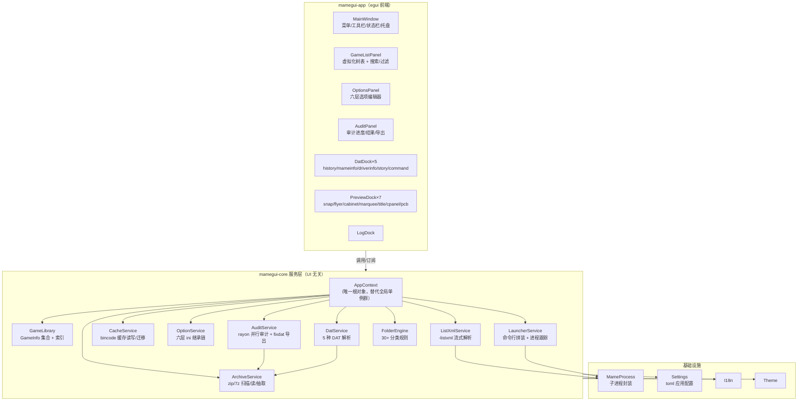
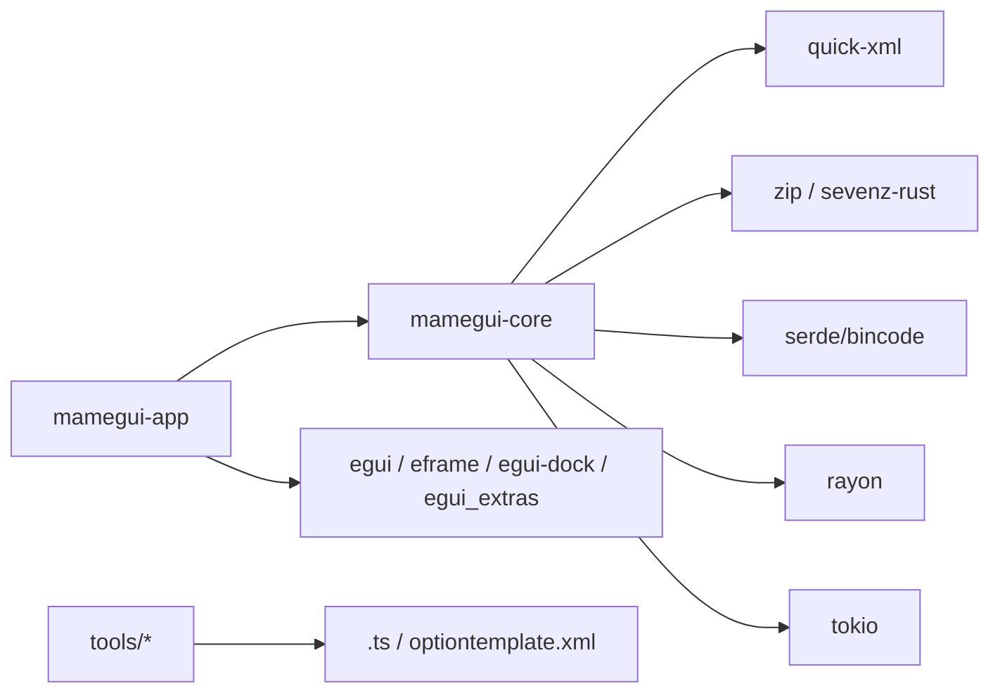
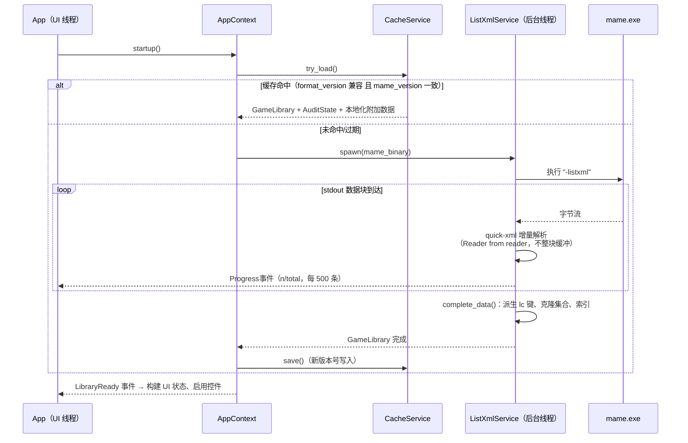
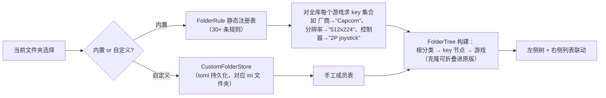
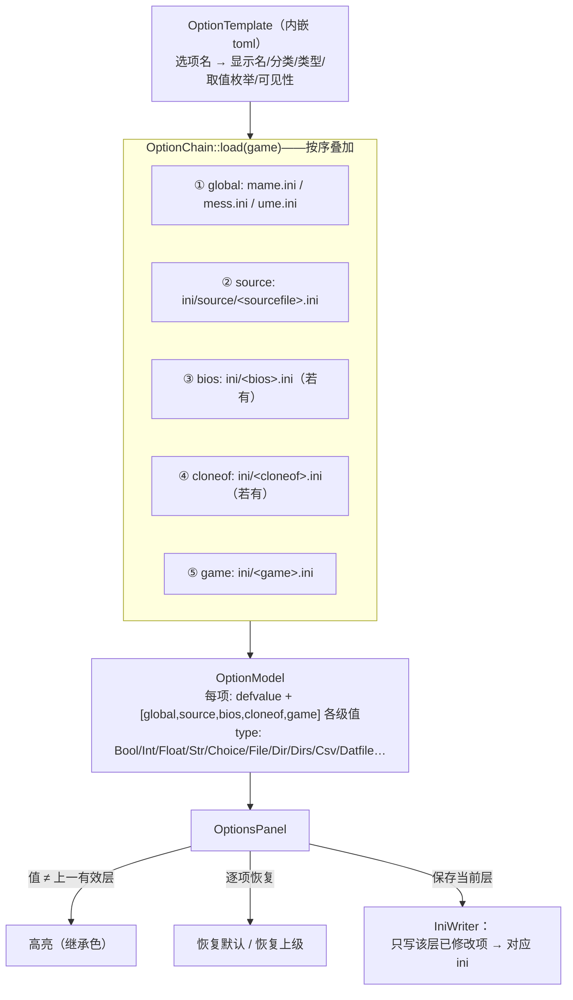
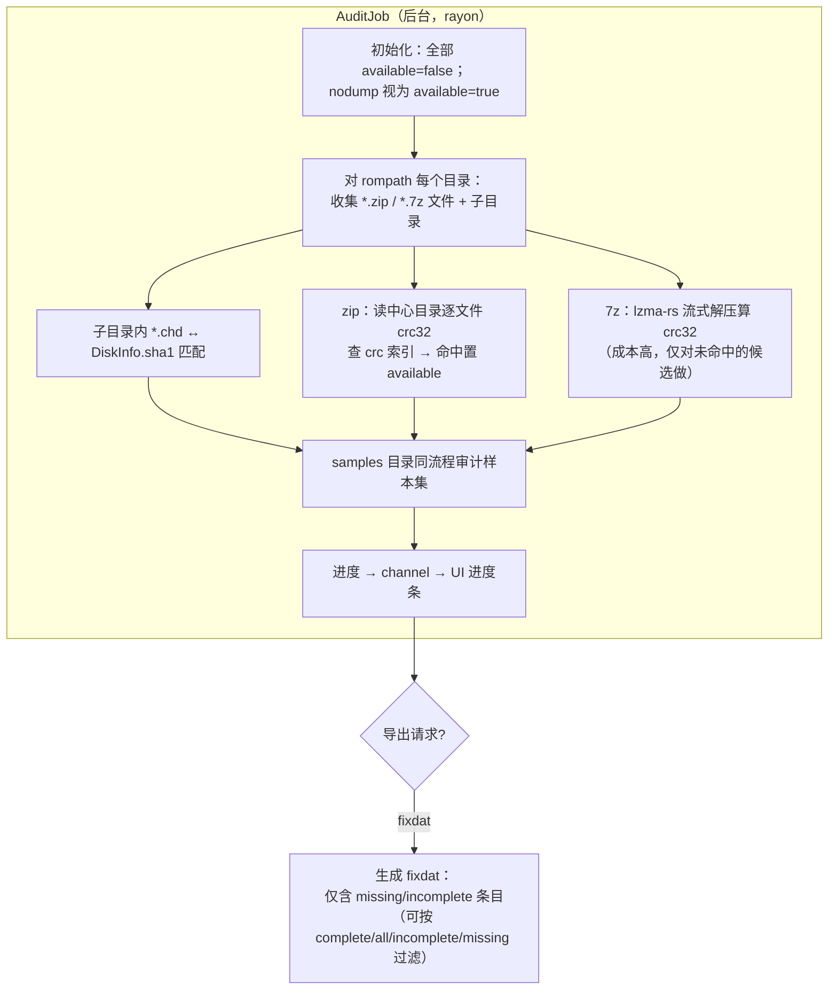
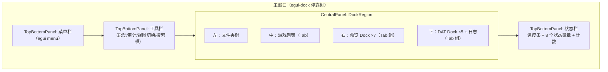
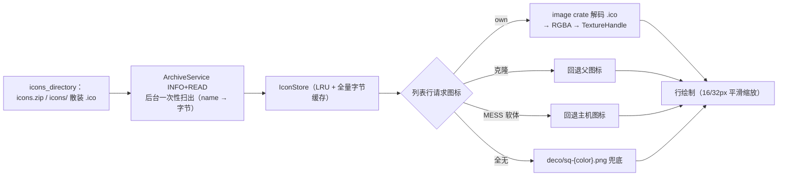
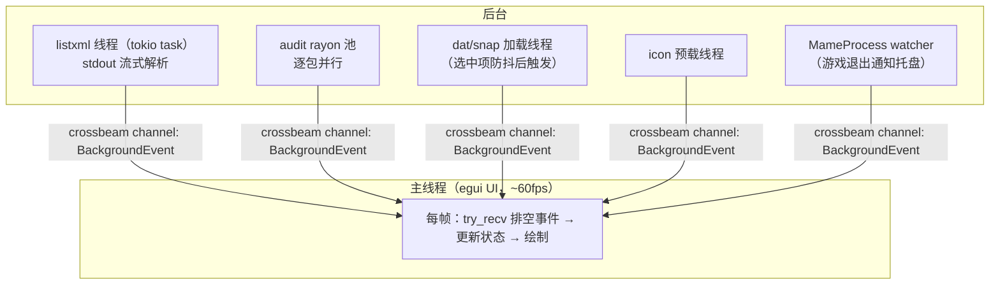

# mamegui-rs 重构项目技术架构设计（Rust + egui）

> 本文档是 **mamepgui（MAME Plus! GUI）1.8.2** 的重写版设计文档。
> 技术路线：**Rust + egui（eframe）**，目标平台 Windows 优先，兼顾 Linux/macOS。
> 原项目的技术分析见同目录 [README.md](README.md)；本文只描述**新项目**，不涉及代码实现。
>
> 设计总原则：**忠实复刻原项目的功能与交互**（列表/六层选项/审计/DAT 面板），
> 但用 Rust 的方式重做——数据层全部结构化、无全局单例蜘蛛网、所有耗时操作异步化、
> 缓存格式带版本可迁移。

---

## 目录

1. [设计目标与范围](#一设计目标与范围)
2. [技术栈清单](#二技术栈清单)
3. [总体架构](#三总体架构)
4. [源码架构（Cargo Workspace）](#四源码架构cargo-workspace)
5. [核心数据模型](#五核心数据模型)
6. [具体业务实现设计](#六具体业务实现设计)
7. [UI 层设计（egui）](#七ui-层设计egui)
8. [字体方案](#八字体方案)
9. [图标方案](#九图标方案)
10. [翻译 / 多语言方案](#十翻译--多语言方案)
11. [主题、皮肤与背景](#十一主题皮肤与背景)
12. [并发与线程模型](#十二并发与线程模型)
13. [配置、缓存与数据文件](#十三配置缓存与数据文件)
14. [错误处理与日志](#十四错误处理与日志)
15. [测试策略](#十五测试策略)
16. [实施里程碑](#十六实施里程碑)
17. [与原项目的功能对照清单](#十七与原项目的功能对照清单)

---

## 一、设计目标与范围

### 1.1 目标

| 编号 | 目标 | 说明 |
| --- | --- | --- |
| G1 | 功能对齐 | 复刻 mamepgui 1.8.2 的核心功能：游戏列表、六层选项、审计、DAT 面板、截图面板、启动 MAME、多语言（**IPS 补丁与 M1 播放器首版不做**，见 1.2） |
| G2 | 单文件绿色程序 | 静态链接，发布为单个 exe，所有资源（字体/图标/翻译）嵌入二进制 |
| G3 | 大列表流畅 | 4 万+ 游戏条目：启动 ≤2s（缓存命中）、滚动/搜索 60fps |
| G4 | 数据层纯净 | `core` crate 不依赖任何 UI，全部可单测 |
| G5 | 缓存可演进 | 二进制缓存带格式版本号，字段变更不清库，能迁移 |
| G6 | 观感 | 工具风基础样式 + 可调主题；暗/亮色与原项目 `isDarkBg` 机制对齐 |

### 1.2 明确不做（首版范围外）

- **IPS 补丁管理器**：整体砍掉（源码级预留：`mamegui-core` 的目录扫描与配置读写基建可复用，
  未来加回时新建 `ips` 模块即可）；
- **M1 街机音乐播放器**：整体砍掉（不引入 `libloading`/FFI 依赖；未来加回时以独立 feature 实现）；
- macOS 的 `.icns` 打包与 PowerPC 时代残留配置；
- 原版 QSettings 布局迁移（作为 P2 加分项，见 §17）；
- 撤销/重做、远程管理这类原版没有的功能。

> 两者回归时的设计结论先留档：IPS 依赖"目录约定扫描 + 依赖/冲突关系表 + 树形勾选 UI"；
> M1 依赖"动态库 FFI + 专用播放线程 + 曲目列表面板"。核心数据层与这两者零耦合，随时可插回。

---

## 二、技术栈清单

| 领域 | Crate（候选） | 替代/备注 |
| --- | --- | --- |
| 运行框架 | `eframe`（egui 官方桌面运行器，wgpu 后端） | 低配机器可切 glow 后端 |
| UI | `egui` + `egui_extras`（TableBuilder）+ `egui-dock`（停靠） | 树表自绘见 §7.2 |
| 托盘 | `tray-icon` | 配合 `winit` 事件桥接 |
| XML 流式解析 | `quick-xml` | 对应 `-listxml`，边收 stdout 边解析 |
| 序列化/缓存 | `serde` + `bincode`（+ `serde` 版本字段） | 替代原 QDataStream 手写序列化 |
| zip | `zip`（读中心目录取 crc，免解压审计） | QuaZip 替代 |
| 7z / LZMA | `sevenz-rust`（解压）、`lzma-rs`（流式读） | 原版 LZMA SDK 替代 |
| crc32 | `crc32fast` | zip 包内文件 crc 校验 |
| sha1 | `sha1`（RustCrypto） | CHD 盘校验 |
| 并行 | `rayon`（审计并行扫描）+ `crossbeam-channel`（进度上报） | |
| 子进程 | `tokio`（`process::Command` + stdout 流）或 `std::process` + 读线程 | 推荐 tokio，统一异步 |
| SDL 摇杆 | `sdl2`（feature 门控，默认关） | 复刻 `USE_SDL` 可选能力 |
| 图像解码 | `image`（png/ico/jpeg） | 游戏图标 .ico 也走这里 |
| INI | 手写小解析器（约 200 行，贴合 MAME 语义） | 不用 configparser：MAME ini 有大小写/引号/数组特殊性 |
| 错误 | `thiserror`（库层）+ `anyhow`（应用层） | |
| 日志 | `tracing` + `tracing-subscriber`（文件 + UI 双 sink） | UI 日志面板订阅同一来源 |
| i18n | `rust-i18n`（yaml/toml 词表） | 从旧 `.ts` 一次性转换，见 §10 |
| 正则 | `regex` + `once_cell` 静态表 | command.dat 记谱转换、DAT 解析 |
| 时间/版本比较 | `semver`（MAME 版本比较，用于缓存失效） | |

发布配置：`cargo build --release` + `strip` + `panic = "abort"` + LTO，
Windows 上用 GitHub Actions 产出单 exe。

---

## 三、总体架构

### 3.1 分层架构图



### 3.2 与原项目架构的关键差异

| 原项目 | 新项目 | 动机 |
| --- | --- | --- |
| 9 个 `extern` 全局单例互相引用 | 一个 `AppContext` 根对象按需向下传递（egui 直接把 `&mut AppContext` 传进各面板） | 消除蜘蛛网依赖，可测试 |
| `GameInfo` 一类背负全部字段（含图标缓存、树指针、审计结果） | 数据结构按域拆分：元数据 `GameMeta` / 审计结果 `AuditState` / 运行时缓存 `IconEntry`，用 id 关联 | 字段归属清晰，缓存可单独失效 |
| Qt 信号槽跨线程 | `crossbeam-channel` 事件流 + egui `ctx.request_repaint()` | immediate mode 没有信号槽；后台线程发事件，UI 线程每帧 `try_recv` 排空 |
| QThread / QtConcurrent | `std::thread` + tokio task（子进程/网络型 IO），`rayon`（CPU 并行审计） | 见 §12 |
| 手写 QDataStream 序列化 | serde derive + 显式 `format_version` + 迁移函数链 | G5 |

---

## 四、源码架构（Cargo Workspace）

```
mamegui-rs/                     # Cargo workspace 根
├── Cargo.toml                  # [workspace] members = ["crates/*"]
├── assets/                     # 构建期嵌入（include_bytes!/include_str!）
│   ├── fonts/                  # 字体：NotoSansSC-Regular.otf、NotoSansMonoCJKsc-Regular.otf 等
│   ├── icons/                  # 内嵌 UI 图标（PNG）：status/、view/、media/、device/、deco/
│   ├── i18n/                   # 10 国语言词表（由旧 lang/*.ts 转换生成）
│   ├── templates/option-template.toml   # 由旧 res/optiontemplate.xml 转换
│   └── app-icon.png            # 256px 应用图标（托盘/窗口）
├── crates/
│   ├── mamegui-core/           # ★ 全部业务逻辑，零 UI 依赖（不含 egui feature）
│   │   └── src/
│   │       ├── lib.rs
│   │       ├── model/          # GameMeta / RomInfo / DiskInfo / ChipInfo / Display /
│   │       │                   # Control / Device / BiosSet / SoftwareList / AuditState
│   │       ├── library.rs      # GameLibrary：IndexMap<path/名称, id> + 二级索引（crc→roms、clone 树）
│   │       ├── listxml.rs      # -listxml 流式解析器（quick-xml，逐事件构造 GameMeta）
│   │       ├── cache.rs        # 缓存读写 + 版本迁移链
│   │       ├── mame/           # MameProcess（子进程封装）、version 探测、-verifyroms 封装
│   │       ├── options/        # ini 词法/语法、六层继承链 OptionChain、模板加载、ini 写回
│   │       ├── archive/        # zip/7z 统一扫描接口（SCAN/INFO/READ/EXTRACT 四模式）
│   │       ├── audit/          # 内置审计（rayon）、fixdat 导出、控制台软体扫描
│   │       ├── dat/            # history/mameinfo/driverinfo/story/command 五种解析器
│   │       ├── folders.rs      # 分类规则引擎（FolderRule trait + 30+ 实现）
│   │       ├── launcher.rs     # 启动命令行拼装（街机/MESS/命令行模式）
│   │       └── settings.rs     # 应用配置（toml）结构定义
│   ├── mamegui-app/            # ★ egui 前端（二进制 crate）
│   │   └── src/
│   │       ├── main.rs         # eframe 启动、AppContext 装配、事件泵
│   │       ├── app.rs          # App（eframe::App 实现）：顶层布局/停靠树/每帧调度
│   │       ├── context.rs      # AppContext：core 服务句柄 + UI 状态（选中项、过滤器、缓存纹理）
│   │       ├── events.rs       # BackgroundEvent 枚举 + 事件通道封装
│   │       ├── panels/         # gamelist.rs / options.rs / audit.rs / logs.rs
│   │       ├── docks/          # preview.rs（7 图像）/ dat_text.rs（5 文本）
│   │       ├── dialogs/        # play_options.rs / directories.rs / about.rs / cmdline.rs
│   │       ├── widgets/        # 虚拟化树表、状态徽章行、可复用控件
│   │       ├── theme.rs        # 明/暗主题、背景图、字号、间距
│   │       ├── fonts.rs        # 字体装载与回退链
│   │       ├── icons.rs        # 内嵌图标注册表 + 纹理缓存
│   │       └── tray.rs         # 托盘集成
│   └── tools/
│       ├── ts2i18n/            # 一次性工具：Qt .ts → rust-i18n 词表
│       └── opttpl2toml/        # 一次性工具：optiontemplate.xml → toml
└── tests/                      # 跨 crate 集成测试（真实 -listxml 样本夹具）
```

**依赖方向（mermaid）**：



规则：`mamegui-core` **禁止**出现 egui/eframe 依赖；UI 与 core 之间只通过
`AppContext` 方法调用和 `BackgroundEvent` 通道交互。

---

## 五、核心数据模型

不写代码，用表格定义结构（字段名即未来字段语义）。

### 5.1 GameMeta（对应原 GameInfo 的元数据部分）

| 字段组 | 字段 | 类型 | 说明 |
| --- | --- | --- | --- |
| 标识 | id | u32（内部 id） | 全部集合用 id 互联，名称只做显示与外部键 |
| 标识 | name | String | ROM 名（`-listxml` 的 `name`），全局唯一键 |
| 关系 | cloneof / romof / sampleof | Option\<String\> | 克隆父 / 系统父 / 样本集父 |
| 关系 | is_bios / is_device | bool | |
| 归属 | sourcefile | String | 所属驱动源文件（分类"按驱动"的键） |
| 显示 | description / year / manufacturer | String | 原样；小写检索键派生存于索引而非模型 |
| BIOS | bios_sets | Vec\<BiosSet{ name, description, is_default }\> | |
| ROM | roms | Vec\<RomInfo{ name, bios, size, crc32, merge, region, status }\> | **crc32 为审计匹配键**；`status == "nodump"` 视为可用 |
| 盘 | disks | Vec\<DiskInfo{ name, sha1, merge, region, index, status }\> | CHD，sha1 为键 |
| 样本 | samples | Vec\<String\> | |
| 硬件 | chips | Vec\<ChipInfo{ name, tag, chip_type, clock }\> | CPU/声卡 |
| 硬件 | displays | Vec\<DisplayInfo{ kind, rotate, flipx, width, height, refresh, … }\> | 分辨率/刷新分类的来源 |
| 硬件 | sound_channels | u8 | |
| 输入 | players / buttons / coins | u8 | |
| 输入 | controls | Vec\<ControlInfo{ kind, min, max, sensitivity, keydelta, reverse }\> | |
| 软列表 | softwarelists | Vec\<SoftwareListRef{ name, status, filter }\> | |
| MESS | devices | BTreeMap\<instance, DeviceInfo{ kind, tag, mandatory, extensions }\> | 挂载/启动用 |
| 驱动状态 | status / emulation / color / sound / graphic / cocktail / protection | u8 | 0=good 1=preliminary 2=imperfect 64=N/A |
| 驱动状态 | savestate | u8 | supported/unsupported |
| 驱动状态 | palettesize | u32 | |
| 其他 | ram_options | Vec\<u32\> + default_ram_option | MESS 主机内存选项 |
| 其他 | is_mechanical / is_gamble | bool | 分类用 |

### 5.2 运行态附加结构（与元数据分离）

| 结构 | 内容 | 生命周期 |
| --- | --- | --- |
| `AuditState` | 每游戏：overall（Missing/Complete/Incomplete）、每 ROM/Disk 的 available | 审计任务产出，可整体替换；与缓存合并保存 |
| `IconEntry` | 游戏图标的解码后 RGBA + 来源（own/parent/system） | 内存 LRU + 磁盘缓存 |
| `LocalizedEntry` | 本地化描述/厂商（复用旧翻译数据）、日文注音 reading | 从 i18n 附加数据加载 |
| `ExtRomEntry` | MESS 软体：system(romof)、容器路径、包内路径、扩展名 | 扫描产出，键 = `容器路径[/包内条目]` |

### 5.3 索引设计（GameLibrary）

- 主存储：`IndexMap<String /*name 或 ext-rom 键*/, GameSlot>`，保持插入序稳定（列表稳定分页）；
- 辅助索引（懒构建、随库刷新重建）：
  - `crc32 → Vec<(game_id, rom_index)>`（审计 O(1) 命中，对应原 `QMultiHash<crc, RomInfo*>`）；
  - `cloneof → Vec<game_id>`（克隆继承图标/分类）；
  - `lowercase(description)/reading → game_id`（搜索排序）；
  - `sourcefile / year / manufacturer → Vec<game_id>`（高频分类文件夹直接取）。

---

## 六、具体业务实现设计

### 6.1 游戏列表装载（对应 prototype.cpp + MameDat）



实现要点：

1. **流式解析**：`tokio::process::Child::stdout.take()` → `BufReader` →
   `quick_xml::Reader::from_reader(...)`，逐事件（Start/Text/End）驱动一个
   `ListXmlBuilder` 状态机；`<game>` 开标签建 GameMeta，子元素追加，闭标签入。
   100MB 级输入全程不整块驻留内存（原版是整块攒进 QByteArray 后 SAX，这里更进一步）。
2. **fixdat 合并**：`pFixDat` 的对应物是 `load_fixdat(path)`，把补全 DAT 解析成
   `GameMeta` 后按 rom name/disk sha1 合并进主库，标记 `from_fixdat`。
3. **MESS 软体**：扫描 `<主机>_extra_software` 目录（复用审计的目录遍历），
   生成 `ExtRomEntry` 挂进主库，键为 `容器[/包内条目]`；容器里的软体条目名从
   ArchiveService 的 INFO 模式取得（zip 直接读名字，7z 流式列头）。
4. **缓存**（对应 gamelist.cache）：
   - 文件：`<cfg>/cache/library.bin`；
   - 头部：magic `MAMEGUIRS1`（8 字节）+ `format_version: u16` + `mame_version: String` +
     `created_at`；magic/版本不认则整库重建；
   - mame_version 不一致：同样整库重建（与原版一致，因为驱动元数据全变）；
   - format_version 升级：走 `Vec<Box<dyn Migration>>` 迁移链（v1→v2→…），
     只在字段删除/重命名时写迁移，新增可空字段用 serde default 兼容；
   - AuditState 与本地化附加数据随库一起序列化（对应原版"继承上次审计结果/图标/中文名"）。

### 6.2 分类文件夹引擎（对应 gamelist.cpp 的 30+ FOLDER_*）



- 规则用 trait `FolderRule { fn key(&self, g: &GameMeta) -> Vec<String>; }` 实现，
  一个游戏可属于多个 key（如一台机器有 2 个 CPU → 同时出现在两个 CPU 文件夹）；
- 内置规则覆盖原版全集：全部/可用/不可用、厂商、年份、驱动源、BIOS、CPU、声卡、
  硬盘、样本、分辨率、调色板大小、刷新率、显示类型、控制器、声道、存档支持、
  机械式、原版/克隆等；
- **可用文件夹依赖审计结果**：规则拿到 `&AuditState` 联合判定；
- 自定义文件夹（收藏、用户分组）持久化为 toml，等价原版的 `<文件夹>.ini`；
- MESS 主机分类呈现"主机 → 软体"两级（软体挂主机节点下），对应 `consoleMap`。

### 6.3 游戏列表 UI 与搜索（对应 gamelist.cpp 模型三件套）

见 §7.2（控件设计）。数据侧：

- 过滤状态：`FilterState { folder: FolderSelection, search: String, hide_clones: bool, … }`；
- 每帧派生"可见 id 序列"——对 4 万条目做一次线性过滤的成本极低（纯内存比较），
  但仍做**惰性增量**：只有 FilterState 或审计结果变化才重算，结果存 `Vec<RowId>`；
- 排序：列点击 → 按 `display_data` 的排序键排序 `Vec<RowId>`（预提取排序键，避免每帧比较字符串）。

### 6.4 六层选项继承链（对应 mameopt.cpp）



实现要点：

1. **ini 解析**：手写词法——`;`/`#` 注释、`key = value`、值含引号剥离、
   数组型选项（`rompath = a\nb` 多行缩进续行）压成分号列表；键大小写不敏感匹配模板；
2. **模板**：`option-template.toml` 由旧 `optiontemplate.xml` 一次性转换（tools/opttpl2toml），
   运行时另做**特性探测**（等价原版的 isSDLPort/hasLanguage/hasIPS/hasDevices）：
   扫 MAME 版本号 + `-showusage` 输出中出现的关键选项名，缺的项自动隐藏；
3. **CSV 型选项**（对应 CsvCfgUI）：弹出子编辑器，按模板给出的列定义展示勾选表；
4. **GUI 层设置**（原 OPTLEVEL_GUI）不进 ini 体系，走 §13 的 toml 配置；
5. **命令行模式**（对应 RUNMAME_CMD）：`OptionChain::diff_from_default(game)` 产出
   `Vec<(name, value)>`，布尔转 `-opt`/`-noopt`，其余 `-opt value`，
   填入可编辑命令行对话框，确认后以 `-noreadconfig` 执行。

### 6.5 审计（对应 audit.cpp）



- 并行粒度：**每压缩包一个 rayon 任务**（IO 密集 + 少量 CPU），crc 索引是只读共享，
  结果写回走 `Mutex<…>` 批量合并（或预分片），避免细锁；
- 7z 的 crc 直读支持有限，策略与原版一致：**先靠 zip 覆盖大多数 ROM，7z 解压兜底**，
  解压结果带 `mtime+size` 的 memo 缓存避免重复算；
- MAME 代理审计（`-verifyroms`）：MameProcess 跑单游戏，stdout 逐行进审计结果对话框；
- 控制台软体审计复用 §6.1 的 ExtRom 扫描（扩展名过滤来自 `DeviceInfo.extensions`）。

### 6.6 DAT 文本面板（对应 UpdateSelectionThread）

- 选中游戏变更（防抖 150ms）→ 后台任务并行解析 5 个 DAT：
  - history.dat：XML/文本双格式探测（原版按版本有两种格式），转换成内部富文本节点
    （标题/段落/系统徽标）→ egui `RichText` 布局；
  - mameinfo.dat / driverinfo.dat：纯文本 + 简单段落高亮；
  - story.dat：文本 + 内嵌图片标记；
  - command.dat：**记谱转换**——正则表把 `_4_1_2_3_6` → 半圈图标、`_A` → 按键图标、
    `★/☆` → 星标（图标见 §9.3），输出为"文本 + 内联图标"混合行渲染；
- 每个面板独立缓存 `{(dat_file_mtime, game_name) → 渲染结果}`；
- 截图面板：7 类目录按优先级查找 `snap/<game>.png`（含克隆回退到父），解码后入纹理缓存。

### 6.7 启动 MAME（对应 Gamelist::runMame）

`LauncherService::build(args)` 流程，忠实对齐原版：

1. 街机游戏：`[用户附加参数] + <game name>`；
2. MESS：系统名 + 遍历 `devices`，已挂载的追加 `-<instance> <path>`；mandatory 未挂载
   → 返回错误清单给 UI 弹窗；
3. 7z 合并包内的软体：先 ArchiveService EXTRACT 到临时目录，进程退出后清理
   （启动时登记临时文件，`waitpid` 回收后删除）；
4. 语言支持（非俄语）：追加 `-langpath` / `-language`；
5. 命令行模式：见 §6.4 第 5 点；
6. 启动后 `MameProcess` 跟踪退出状态 → 托盘图标切换"运行中"状态。

### 6.8 预留接口说明（IPS / M1，首版不实现）

- **IPS 补丁管理**（未来模块 `core::ips` + `IpsDialog`）：依赖的三块基建均已存在——
  目录约定扫描（复用 ArchiveService）、ini 式配置读写（复用 options 模块）、树形勾选 UI。
  回归时按原版逻辑补"依赖/冲突关系表 + 启用配置写回"即可；
- **M1 音乐播放器**（未来模块 `core::m1`，feature 门控）：需要 `libloading` 动态库 FFI +
  专用播放线程 + 停靠面板。首版不引入 FFI 依赖；UI 层媒体图标组（§9.2）仍随资源嵌入，
  届时直接可用。

---

## 七、UI 层设计（egui）

### 7.1 顶层布局



- 停靠树布局保存/恢复到配置（对应原版 QSettings 里的窗口几何/停靠布局）；
- 菜单结构与原版对应并按首版范围裁剪（File/Game/Options/View/Language/Help，
  无 IPS/M1 入口），
  语言切换后整树重建（egui 每帧重建 UI，语言切换天然即时生效——**优于原版要重启**）；
- 托盘：`tray-icon` 三态（空闲/加载中/MAME 运行中），左键显示/隐藏窗口，
  MAME 退出事件经通道回 UI。

### 7.2 游戏列表控件（自研虚拟化树表）

原版 `QTreeView + QSortFilterProxyModel + QItemDelegate` 的 egui 对应物**自己写**，
这是 UI 层最大的一块自研工作，设计如下：

| 能力 | 实现方式 |
| --- | --- |
| 虚拟化 | `ScrollArea::show_rows(total_rows, row_height)`——只让可见行进入绘制，4 万行无压力 |
| 多列 | 行内 `Grid`/手动 `allocate_ui_at_rect` 分列；列宽存配置；表头点击排序、右键显隐列（对应 headerMenu） |
| 视图模式 | 5 种（Details/Grouped/List/SmallIcon/LargeIcon）＝同一行数据的三种渲染分支：表格式 / 树式（克隆缩进 16px）/ 图标网格 |
| 自绘行 | 每行：图标纹理 + 描述（状态色：绿/黄/红映射驱动状态）+ 各列文本；选中行画 deco 背景纹理（亮/暗两套，见 §9.2） |
| 克隆折叠 | Grouped 模式下原版行为：原版一行、克隆缩进；展开状态存 `HashSet<game_id>` |
| 交互 | 单击选中、双击启动、右键菜单（上下文感知：MESS 设备挂载/收藏/自定义文件夹/删除 cfg/sta）、Ctrl+F 聚焦搜索框、F5 刷新 |
| 键盘 | 上下移动 + 字母前缀跳转（对应原版键盘导航） |
| 摇杆 | feature `sdl` 开启时后台轮询 SDL 事件，映射为上下选择（复刻原版可选能力） |

### 7.3 选项编辑器控件

- 左：分类列表（含图标）；右：该分类的选项表；
- 每行：标签 + 按类型分派的编辑控件 + **行尾"恢复默认"小按钮**（对应 ResetWidget）；
- 类型分派：Bool→开关、Int→拖杆+数值、Float→拖杆、Choice→下拉、
  File/Dir→文本+浏览按钮、Dirs→多行列表编辑器（增删改排序）、Csv→子对话框入口；
- 继承高亮：值 ≠ 上一有效层的行用强调底色；顶部标签页（Global/Source/Bios/Cloneof/Game）
  切换即重载对应层（对应 chainLoadOptions，同样**懒加载**）。

### 7.4 其余面板

- 审计面板：进度条 + 每包日志流（虚拟滚动）+ 完成后统计 + 导出 fixdat 按钮（带范围选择）；
- 预览 Dock：图像等比缩放填充面板，支持旋转（对应 screenshot.cpp），点击放大浮层；
- DAT Dock：RichText 渲染，字号可调，command 面板用等宽字体 + 内联图标；
- 日志 Dock：`tracing` UI sink 的订阅视图，带级别过滤；
- 对话框：播放选项（存档/回放/录像 MNG/AVI/WAV 文件选择）、目录编辑、关于、命令行预览。

---

## 八、字体方案

**策略：全部自带、构建期嵌入（include_bytes!），不依赖系统字体。**

| 用途 | 字体 | 说明 |
| --- | --- | --- |
| 界面主字体 | **Noto Sans SC**（Regular/Medium 两档） | 覆盖简繁日韩常用字（CJK 统一表意区），拉丁部分质量好；egui 默认字体不含 CJK，必须自带 |
| 界面备用/覆盖 | Noto Sans JP / TC 子集 | 若翻译词表出现 SC 缺字（如繁体专用形）时的回退链成员 |
| 等宽字体 | **Noto Sans Mono CJK SC**（或 Sarasa Mono SC） | command.dat 的 ASCII 字符画 + 日文混排必须等宽且含假名——对应原版强制 MS Gothic 的场景；自带字体同时消除对"系统装没装 MS Gothic"的依赖 |
| 图标占位 | 无需图标字体 | 本项目图标全部走 PNG 纹理（§9），不引入 icon font |

装载与配置细节：

1. `fonts.rs` 在 eframe 启动时构造 `FontDefinitions`：
   顺序为 `[用户配置字体（可选）] → Noto Sans SC → Noto Sans JP → Noto Sans TC → 内置拉丁回退`，
   等宽族同理；egui 按.family 顺序做**逐字回退**，简繁混排不豆腐块；
2. 字号体系（对应原版"中文界面 9pt"的 hack）：基准 13px（egui 逻辑像素），
   CJK 下同样适用；提供设置项 `ui_font_scale`（0.8–1.6）与 DAT 面板独立字号；
3. 子集化（可选优化）：用 `fonttools` 在构建期把 SC 字体裁成"翻译词表 + 常用 3500 字 +
   GB 常用集"子集，体积可从 ~10MB 压到 ~2MB；首版先嵌全量，符合 G2 再优化；
4. 用户自定义字体：设置里指向本机 ttf/otf，加载失败回退内嵌字体并记日志。

---

## 九、图标方案

复刻原项目"四层图标"体系（见原 README §6.1），逐层映射：

### 9.1 程序图标

- `assets/app-icon.png`（256px）→ `set_window_icon` + `tray-icon` 图标（tray 需 ico 转换，构建脚本用 `image` 现做）；
- Windows exe 资源（文件属性里的图标）：`build.rs` + `winresource` crate 嵌入 `.ico`（等价原 `mamepgui.rc` 的角色）。

### 9.2 内嵌 UI 图标（assets/icons/，全部 PNG，include_bytes!）

| 组 | 文件约定 | 用途 | 对应原资源 |
| --- | --- | --- | --- |
| 状态徽章 | `status/{status,emulation,color,sound,graphic,cocktail,protection}-{good,preliminary,imperfect}.png` + `savestate-{supported,unsupported}.png` + `status-na.png` | 状态栏 8 徽章；**动态拼路径**注册表取图；N/A（值 64）隐藏对应槽位 | 原 16x16/{维度}_{档位}.png |
| 默认列表图标 | `deco/sq-{green,yellow,red}.png` | 无专属图标游戏的状态色兜底（可用/黄/差） | sqr-g/y/r.png |
| 选中装饰 | `deco/selection-{bright,dark}.png` | 图标视图当前项高亮底框，按主题明暗选择 | deco-brightbg/darkbg |
| 截图占位 | `deco/placeholder-{mame,mess}.png` | 无 snap 时的占位快照 | mamegui/mame.png、mess.png |
| command 记谱 | `cmd/dir-{1..9}.png`、`cmd/dir-{hcf,hcb,qdf,qdb}.png`、`cmd/btn-{A..S,+}.png`、`cmd/btn-n{a..f}.png`、`cmd/star-{gold,silver}.png` | command.dat 记谱 → 内联图标（§6.6） | dir-*/btn-*/star_* |
| 设备 | `device/{floppy,harddisk,printer,optical}.png` | MESS 挂载菜单按设备类型选图 | media-floppy 等 |
| 媒体 | `media/{play,pause,stop,record,prev,next}.png` | **预留**：M1 播放器未来回归时使用，首版无 UI 引用 | media-playback-* |
| 视图/工具 | `view/{list,detail,group,licon,sicon,tree,snap}.png`、`search.png`、`clear.png`、`reset-default.png`、`folder.png`、`refresh.png`、`help.png` | 工具栏/动作/表头 | mame32-*/system-search/reset_property 等 |

实现：`icons.rs` 建 `EnumMap<IconId, TextureHandle>` 注册表，启动时一次性解码上传 GPU；
运行期"按名拼路径"的场景（状态徽章、command 记谱）用 `IconId` 查表替代原版的字符串拼路径。

### 9.3 游戏图标（运行时管线）



- 缓存两级：原始字节（解码源，LRU 上限如 64MB）+ 解码纹理（GPU，LRU 上限如 4096 张）；
- 16px/32px 两种预设尺寸预生成，避免每帧重采样；
- 图标库变化（目录/zip 更新）→ 失效重建（对应原版刷新图标）。

### 9.4 预览图（snap 等 7 类）

查找顺序 `snap/<game>.png` → 克隆回退 `snap/<romof>.png` → 占位图；
解码入纹理缓存（LRU 32 张），面板关闭即释放。

---

## 十、翻译 / 多语言方案

- 10 种语言全量继承：`tools/ts2i18n` 一次性把旧 `lang/mamepgui_*.ts` 转成
  `assets/i18n/<locale>.ftl`（或 rust-i18n 的 toml），产出后纳入版本库，不再依赖 Qt 工具链；
- 键结构沿用原 ts 的上下文分层：`mainwindow.exit`、`options.global`、
  `status.good` 等前缀，保证徽章 tooltip（维度+档位动态取词）可用：
  `t(&format!("status.{name}"))` + `t(&format!("state.{state}"))`；
- 回退链：`zh_TW → zh_CN → en`（繁体缺词落简体再落英文），由 rust-i18n fallback 配置；
- 即时切换：egui immediate mode 下换语言 = 换全局 locale 后 `request_repaint()`，
  无需重启（改进点，原版需重启）；
- 字体联动：切 `zh_*`/`ja_*` 时确保 CJK 族在回退链首位（§8）。

---

## 十一、主题、皮肤与背景

- **主题**：egui `Visuals` 明/暗两套预设 + 强调色；对应原版亮暗底机制；
  `is_dark` 状态同时决定：deco 装饰图选哪套、列表文字色、背景图上的文字调色
  （原版亮底黑字/暗底白字的手工 palette 切换在这里收敛成一个主题分支）；
- **背景贴图**：CentralPanel 支持背景图（拉伸/平铺两种模式），实现为绘制层：
  在面板 painter 最底层画图，其上叠加半透明底色保证可读性；
- **行密度**：紧凑/舒适两档行高；
- 主题/背景/密度全部持久化到 §13 的应用配置。

---

## 十二、并发与线程模型



- 事件枚举 `BackgroundEvent`：`Progress{job, n, total}`、`Log{level, msg}`、
  `LibraryReady`、`AuditBatch{updates}`、`SnapReady{game, kind, texture_job}`、
  `MameExited{code}`、`IconReady{game}`……
- **UI 状态只被主线程改写**（single-writer），后台只发数据，杜绝原版裸共享 + 手动锁的模式；
- 重负载取消：审计/扫描任务带 `AtomicBool` 取消位，关闭程序与切换游戏时触发；
- 选中项防抖（150ms）避免快速滚动时 DAT/截图任务风暴；
- 进度节流：`Progress` 事件批量合并（每 100ms 至多一条到 UI）。

---

## 十三、配置、缓存与数据文件

```
<app 数据目录>/                        # 可配置，默认 exe 同目录（保持绿色便携；无写权限时回退 %APPDATA%）
├── mamegui.toml                       # 应用配置（对应 QSettings 部分）
│   # mame 路径、rompath、图标/截图/DAT 目录、语言、主题、
│   # 窗口与停靠布局、列宽/显隐、字号、自定义文件夹注册表
├── cache/
│   ├── library.bin                    # -listxml 解析缓存（magic+版本，§6.1）
│   └── audit-state.bin                # 审计结果缓存（独立失效：rompath 变化即重审）
├── ini/                               # MAME 侧 ini（读写，结构=原版）
│   ├── mame.ini | mess.ini | ume.ini
│   ├── source/*.ini
│   └── <game|bios|cloneof>.ini
├── Favorites.toml                     # 收藏（原 Favorites.ini）
├── <自定义文件夹>.toml
└── logs/mamegui.log                   # tracing 滚动日志
```

- **MAME 侧 ini 保持原版格式与路径**（这样老用户的 ini/ 目录可直接复用），
  GUI 自身状态才用 toml；
- 托盘/单实例：命名互斥锁防双开（原版行为）。

---

## 十四、错误处理与日志

- 库层：`thiserror` 定义类型化错误（`ListXmlError::UnexpectedEof`、
  `ArchiveError::UnsupportedFormat`…），上层可精确匹配；
- 应用层：`anyhow` + 用户可读消息（经 i18n）；所有"外部世界"错误（找不到 mame.exe、
  ini 损坏、缓存魔数不符）**必须可降级**：缓存坏→重建，ini 坏→跳过该层并提示，
  图标库坏→用默认方块，翻译文件缺→回退英文；
- 日志：`tracing` 双 sink（滚动文件 + UI Dock），后台线程日志经事件通道回 UI，
  等价原版 `MyQueue` + 状态栏；
- 用户可见错误一律走对话框/状态栏 toast，不静默。

---

## 十五、测试策略

| 层 | 测试 | 夹具 |
| --- | --- | --- |
| listxml 解析 | 真实 `-listxml` 输出切片（含边界：缺字段、clone/bios/device、软列表）+ 构造假 4 万条目测内存/速度 | `tests/fixtures/listxml_*.xml` |
| ini 六层链 | 各层叠加优先级、nodump、数组选项、写回不破坏注释（写回策略见注） | 手写 ini 样本 |
| 审计 | 构造小 zip（已知 crc）+ 假 7z；断言 available 集合与 fixdat 导出内容 | `tests/fixtures/roms/` |
| DAT 解析 | command 记谱转换表逐条断言；history 双格式样本 | |
| 缓存 | 版本迁移链：旧格式文件 → 升级 → 字段完整 | 二进制夹具 |
| UI | 不做自动化 UI 测试；以"里程碑演示脚本"人工验收（§16） | |

> ini 写回策略：为最大兼容，**只重写键值行、尽量保留原文件的注释与顺序**（逐行 diff 改写），
> 这是老用户 ini 不被"洗掉注释"的关键约束。

---

## 十六、实施里程碑

每步产出可运行程序（沿用原版功能推进逻辑）：

| # | 里程碑 | 验收标准 |
| --- | --- | --- |
| M1 | workspace 骨架 + listxml 解析 + 缓存 | 命令行打印游戏数与原版一致；二次启动 <2s |
| M2 | egui 窗口 + 虚拟化列表 + 搜索过滤 + 2 个分类文件夹 | 4 万行滚动 60fps；搜索即时 |
| M3 | 启动 MAME（街机路径 + 托盘状态） | 双击进游戏、退出恢复 |
| M4 | 全部分类文件夹 + 自定义文件夹 + 收藏 + 5 种视图 | 对照原版逐个文件夹核对 |
| M5 | 六层选项继承 + 编辑 + 写回 | 修改值高亮正确；写回的 ini 可被 mame.exe 直接读取 |
| M6 | 审计 + fixdat 导出 + 状态徽章 | 与原版对同一 rompath 的审计结果一致 |
| M7 | 截图/5 DAT 停靠面板 + command 记谱图标 | 出招表渲染可读 |
| M8 | 多语言 + 字体/主题/背景 + 设置持久化 | 10 语言切换即时生效 |
| M9 | 收尾（单实例、日志、发布流水线、单文件 exe） | 发布流水线产出可用 exe |

后续批次（按需启动）：P2-a IPS 补丁管理器（依赖基建已预留，见 §6.8）；
P2-b M1 音乐播放器（feature 门控）；P2-c 旧版 QSettings 布局迁移。

---

## 十七、与原项目的功能对照清单

| 原功能 | 新实现 | 状态口径 |
| --- | --- | --- |
| -listxml 解析 + gamelist.cache | ListXmlService + library.bin（版本迁移） | 对齐（增强：真流式、缓存可迁移） |
| 30+ 分类文件夹 / 自定义文件夹 / 收藏 | FolderEngine + CustomFolderStore | 对齐 |
| 5 种列表视图 + 自绘委托 + 摇杆导航 | §7.2 自研虚拟化树表（sdl feature） | 对齐 |
| 六层选项继承 + 差异高亮 + CSV 选项 | OptionChain + OptionsPanel | 对齐 |
| 内置审计 + fixdat 导出 + -verifyroms | AuditService（rayon 并行） | 对齐（增强：并行） |
| history/mameinfo/driverinfo/story/command 面板 | DatService ×5 | 对齐 |
| 7 类预览面板 + 截图缩放旋转 | PreviewDock ×7 | 对齐 |
| 启动参数拼装 / MESS 设备挂载 / 7z 临时解压 / 命令行模式 | LauncherService | 对齐 |
| IPS 补丁管理 | 首版**砍掉**；基建已预留（§6.8），后续 P2-a 按需回归 | 暂缓 |
| M1 音乐播放器 | 首版**砍掉**；不引入 FFI 依赖，媒体图标已随资源嵌入，后续 P2-b 按需回归 | 暂缓 |
| 10 国语言 | rust-i18n + 字体回退链 | 对齐（增强：免重启切换） |
| 皮肤/背景/托盘/单文件绿色形态 | Theme/背景层/tray-icon/静态发布 | 对齐 |
| QSettings 布局迁移（读旧版配置） | 未列入首版（P2） | 后续 |
