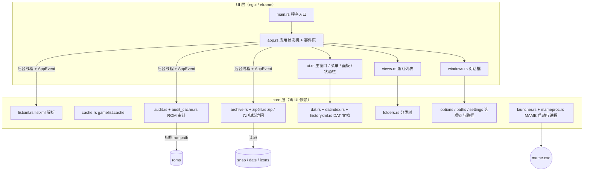
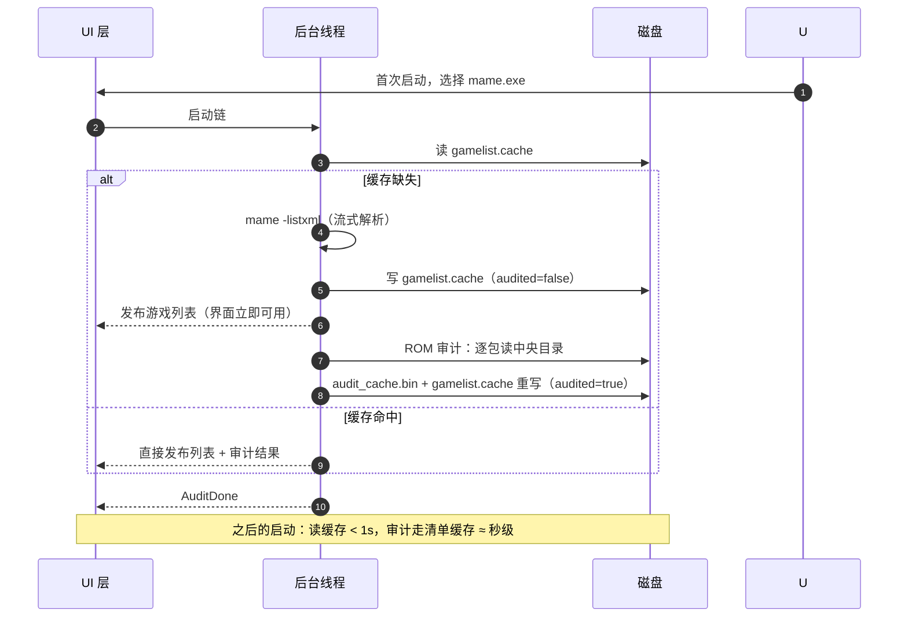

# MvUI

MvUI 是一个原生 Windows 的 [MAME](https://www.mamedev.org/) 前端，使用 Rust +
[egui](https://github.com/emilk/egui) 编写。它把 MAME 的游戏列表管理、素材浏览、
文档查阅与 ROM 审计装进一个现代渲染的单一窗口：

- **游戏列表**：约 5 万条目的虚拟化表格（描述 / 名称 / ROM / 厂商 / 驱动 / 年份 /
  克隆自），Details / Grouped 两种视图，表头点击排序、拖拽换列、拖拽调宽，
  即时搜索与标志过滤（隐藏克隆 / 不可用 / 机械式…）；
- **分类树**：可用性、年份、厂商、驱动、CPU / 音频、分辨率、操作方式等内置维度，
  外部 `folders/*.ini` 分类与 Favorites 收藏；
- **素材面板**：`snap` / `flyers` / `cabinets` / `marquees` / `titles` / `cpanel` /
  `pcb` 七个图片面板，散装文件与 zip / 7z 打包通吃；
- **文档面板**：`history.dat` / `mameinfo.dat` / `story.dat` / `command.dat`
  （出招表记号渲染为方向键与按键图标）、驱动信息；
- **ROM 审计**：可用性判定、克隆族 CRC 复用、CHD 共享传播、fixdat 四种导出、
  have / miss 清单导出；
- **启动**：按 MAME 选项链构建命令行，7z ROM 自动解包到临时目录，设备挂载，
  进程监控；
- **其他**：简中 / 繁中 / 英三语界面，壁纸主题（亮暗自适应），
  本地化游戏列表 `mame_cn.lst`。

---

## 技术架构

项目分两层，边界写在 `src/core/mod.rs`：

- **UI 层**（`src/` 根目录的模块）：egui / eframe 绘制与交互，事件循环之外
  不做任何阻塞工作；
- **core 层**（`src/core/`）：MAME I/O、listxml 解析、ROM 审计、归档访问、
  DAT 索引、选项链、缓存——**零 UI 依赖**（不允许出现 `egui` / `eframe` /
  `rfd`），因此可以脱离窗口做单元测试与无头探测。

后台线程与 UI 之间通过 `AppEvent` 事件通道通信：游戏列表解析、审计、截图 /
文档 / 图标加载全部在工作线程完成，UI 只消费事件并重绘。



### 启动链与缓存

阻塞成本全部由两层缓存摊销——首次启动付一次物理成本，之后每次启动都是秒级：



### 关键设计

- **三层缓存**：`gamelist.cache`（游戏库，bincode，58 MB ↔ <1s 读取）、
  `audit_cache.bin`（归档条目清单，mtime+size 戳失效，二次审计 ≈ 秒级）、
  DAT 字节区间索引（`tag → 字节区间`，查询只读记录自身几百字节）；
- **归档访问**：zip 走中央目录直读（`by_index_raw`，不碰本地文件头）、
  7z 只解析头部不解压数据、自写 Zip64 读取器支持超大素材包；
- **写盘一律 BufWriter + 临时文件原子替换**；
- **阻塞工作永不进 UI 线程**；游戏列表虚拟化——只构建可见行，4.6 万条目
  无帧率悬崖；
- **安全**：Zip Slip 防护（拒绝逃逸解包目录的条目名）、归档头声明大小不参与
  预分配、MAME 通过 `Command::arg` 启动（不经 shell）。

---

## 源码结构

```
.
├── Cargo.toml / Cargo.lock
├── build.rs                    构建脚本：生成图标表、嵌入 exe 图标资源
├── assets/                     图标集 / 应用图标 / 壁纸预设 / optiontemplate.xml
├── docs/                       文档（周边文件加载说明书等）
├── examples/                   无头探针：性能基准与功能对账（见下文）
└── src/
    ├── main.rs                 程序入口（GUI 二进制）
    ├── lib.rs                  库入口：把 core 暴露给 examples 与测试
    │
    │   ── UI 层 ──
    ├── app.rs                  应用状态机：MameApp、事件泵、启动链、设置持久化
    ├── background.rs           后台任务：启动链 / 审计 / 截图 / 文档 / 图标加载线程
    ├── events.rs               AppEvent 事件定义（后台 → UI 的唯一通道）
    ├── ui.rs                   主窗口：菜单、工具栏、dock 面板、状态栏、壁纸
    ├── views.rs                游戏列表：过滤 / 排序 / 表格渲染 / 表头交互
    ├── windows.rs              各对话框窗口
    ├── icons.rs                UI 内嵌图标绘制（状态方块、出招表字形）
    ├── fonts.rs                字体装载
    ├── i18n.rs                 多语言翻译表（zh_CN / zh_TW / en）
    │
    │   ── core 层（零 UI 依赖）──
    └── core/
        ├── listxml.rs          mame -listxml 流式解析 → GameLibrary
        ├── cache.rs            gamelist.cache 读写（bincode + BufWriter）
        ├── audit.rs            ROM 审计：可用性判定、fixdat 导出
        ├── audit_cache.rs      审计清单缓存（mtime+size 戳，二次审计秒级）
        ├── archive.rs          zip / 7z 统一访问（列目录 / 读取 / 解包）
        ├── zip64.rs            自写 Zip64 读取器（超大素材包）
        ├── dat.rs              DAT 解析（history / 出招表记号 → 图标 segment）
        ├── datindex.rs         DAT 字节区间索引（tag → 字节区间）
        ├── historyxml.rs       history.xml 解析与渲染
        ├── folders.rs          分类树引擎（内置维度 + 外部 ini）
        ├── icons.rs            图标包读取（icons.zip / icons.7z / 散装）
        ├── options/            MAME 选项链（模板、全局、逐级覆盖）
        ├── launcher.rs         命令行构建与 MAME 启动
        ├── mameproc.rs         MAME 进程管理（校验、-listxml、-showconfig）
        ├── library.rs          GameLibrary 集合与名字索引
        ├── model.rs            GameMeta 数据模型
        ├── paths.rs            周边文件路径解析（snap / dats / folders…）
        ├── lst.rs              本地化游戏列表（mame_cn.lst）
        └── settings.rs         GUI 设置读写与缓存目录
```

---

## 构建与运行

环境要求：Windows 10+，Rust stable 工具链（edition 2021）。exe 图标嵌入
需要 MinGW 的 `windres` 在 PATH 上——缺失时构建照常成功，仅打印一条
`cargo:warning`。

```sh
cargo build --release        # 产物位于 target/release/
cargo run --release          # 构建并运行
cargo test --release         # 92 个测试
```

### 工具链说明（`.cargo/config.toml`）

仓库自带一份 `.cargo/config.toml`，把 GNU 工具链的链接器指向 MinGW-W64 的
`gcc.exe`（Rust GNU 工具链自带的链接器缺少 `libshlwapi.a` 等导入库）。按你的
安装方式三选一：

| 你的工具链 | 需要做什么 |
|---|---|
| **MSVC**（Windows 默认，`stable-x86_64-pc-windows-msvc`） | **无需此文件**——它只对 GNU 工具链生效，删掉或无视均可（`rustup default stable-x86_64-pc-windows-msvc` 可切换） |
| **MSYS2 的 MinGW** | 把 `linker` 改成你的 gcc 实际路径，如 `C:\msys64\ucrt64\bin\gcc.exe` |
| **MinGW 已在 PATH**（Scoop 独立安装等） | 把 `linker` 改成 `"gcc"`，由 PATH 自动解析 |

仓库中提交的是一台开发机的 Scoop 安装路径，克隆后请按上表改成自己的；
MSVC 用户不受影响。

首次启动：在提示框选择 `mame.exe` → 程序自动执行 `-listxml` 建立游戏库
（一次性，之后走缓存）→ 后台审计 ROM 可用性 → 在 设置 ▸ 目录 确认
rompath / 素材 / DAT 位置即可。

---

## 探测工具（examples/）

`examples/` 下的每个文件都是一个独立的命令行小工具，**直连 core 层、无 UI**，
用于对真实数据做性能测量与功能对账：

```sh
cargo run --release --example <名字> -- <参数>
```

数据准备（多数探针需要一份 listxml 导出）：

```sh
"D:\path\to\mame.exe" -listxml > listxml.xml
```

| 工具 | 用途 | 用法 |
|---|---|---|
| `datindex_bench` | DAT 字节区间索引 vs 全文扫描：对账 + 提速倍数（内置 fixture） | 无参数 |
| `parse_bench` | XML 解析链分阶段计时 + 缓存写盘缓冲对比 | `-- <listxml.xml>` |
| `audit_probe` | 真实 rompath 审计全程计时，每 10s 打印进度 | `-- <listxml.xml> "<rompath1>;<rompath2>"` |
| `audit_bench` | 审计冷 / 热 × 有无清单缓存对比 | 参数见文件头注释 |
| `folder_probe` | 解析 listxml，对账分类树计数与状态栏行数 | `-- <listxml.xml>` |
| `zip_probe` | 单 zip 列目录成本解剖（中央目录 vs 本地文件头） | `-- <rom目录> [采样数]` |
| `open_probe` | 单包成本再拆分：打开文件 vs 读中央目录 | `-- <rom目录> [采样数]` |
| `par_scan_probe` | 顺序 vs 多线程扫描吞吐对比 | `-- <rom目录> [每组数量]` |
| `sevenz_probe` | 7z 固实 / 非固实 / 压缩头列目录成本，CRC 存在性 | `-- <含7z目录> [对照zip]` |
| `dat_probe` | 真实 DAT 走索引 / 扫描两条路径对账 | `-- <dat> <dock> <tag>` |
| `history_dump` / `history_pipe` / `history_check` | history.xml 单条渲染 / 全管线 / 索引自检 | 参数见文件头注释 |
| `mame_check` / `mame_help_probe` | MAME 二进制校验复现 / `-help` 输出逐字节 | `-- <mame.exe路径>` |
| `cache_check` | 启动缓存链无头自检 | 参数见文件头注释 |

每个工具的文件头部注释都有它测什么、怎么用的完整说明。

---

## 许可

GPL-3.0-or-later（见 `LICENSE` 与 `Cargo.toml`）。
